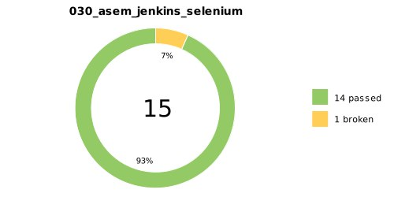

# Test Automation Project for [Demo Web Shop](https://demowebshop.tricentis.com/)

<p align="center">
  
</p>


## **Contents:** ##

* <a href="#tools">Technologies and tools</a>

* <a href="#cases">Automated Test Cases</a>

* <a href="#jenkins">Build in Jenkins</a>

* <a href="#console">Running from Terminal</a>

* <a href="#allure">Allure report</a>

* <a href="#testops">Integration with Allure TestOps</a>

* <a href="#jira">Integration with Jira</a>

* <a href="#telegram">Telegram notification with bot</a>

* <a href="#video">Selenoid test execution video examples</a>

* <a href="#POM">Page Object Model to keep code clean and maintainable</a>


-----
<a id="tools"></a>
## <a name="Technologies and tools">**Technologies and tools:**</a>

<p align="center">
<a href="https://git-scm.com/">  </a>
<a href="https://junit.org/junit5">  </a>
<a href="https://www.selenium.dev/">  </a>
<a href="https://qameta.io/">  </a>
<a href="https://www.jenkins.io">  </a>
<a href="https://allurereport.org/">  </a>
<a href="https://github.com/"> </a>
<a href="https://gradle.org">  </a>
<a href="https://www.docker.com/">  </a>
<a href="https://web.telegram.org/">  </a>
<a href="https://aerokube.com/selenoid/"></a>
<a href="https://www.atlassian.com/software/jira">  </a>
<a href="https://www.w3schools.com/java/">  </a>
</p>

- The UI autotests were written in **Java**.
- **Gradle** was used as a builder.
- **JUnit 5** and **Selenium** frameworks were used as test frameworks.
- For remote run, a job in **Jenkins** with **Allure report** generation and result send to **Telegram** via a bot has been implemented.
- Integration with **Allure TestOps** and **Jira** has been established.


----
<a id="cases"></a>
## **Examples of automated test cases:**
**------------**
- ✅ User Registration
- ✅ Login Functionality
- ✅ Product Search
- ✅ Add to Cart
- ✅ Checkout Process

**------------**
- ✅ ------------
- ✅ ------------
- ✅ ------------
- ✅ ------------


----
<a id="jenkins"></a>
## Build in Jenkins ([link](https://jenkins.autotests.cloud/job/030_asem_jenkins_selenium/))
<p align="center">  
<a href="https://jenkins.autotests.cloud/job/030_asem_jenkins_selenium/"></a>  
</p>

### **Jenkins build options:**

- `BROWSER_SIZE` (default screen size - 1920x1080)
- `REMOTE_URL`


----
<a id="console"></a>
## Run from Terminal
___
**Local launch**
```bash  
gradle clean test
```

**Remote launch via Jenkins**
```bash
clean test
-DremoteUrl=${REMOTE_URL}
-DbrowserSize=${BROWSER_SIZE}
```


----
<a id="allure"></a>
## Allure report ([link](https://jenkins.autotests.cloud/job/030_asem_jenkins_selenium/allure/))

**Main report page**
<p align="center">  
<a href="https://jenkins.autotests.cloud/job/030_asem_jenkins_selenium/allure/"></a>  
</p>

**Test cases**
<p align="center">  
<a href="https://jenkins.autotests.cloud/job/030_asem_jenkins_selenium/allure/"></a>  
</p>


----
<a id="testops"></a>
## Integration with Allure TestOps ([link](https://allure.autotests.cloud/launch/42891))
<p align="center">  
<a href="https://allure.autotests.cloud/launch/42891"></a>  
</p>

**Manual test cases**
<p align="center">  
<a href="https://allure.autotests.cloud/launch/42891"></a>  
</p>

**Automation test cases**
<p align="center">  
<a href="https://allure.autotests.cloud/launch/42891"></a>  
</p>

----
<a id="jira"></a>
## Integration with Jira ([link](https://jira.autotests.cloud/browse/HOMEWORK-1367))
<p align="center">  
<a href="https://jira.autotests.cloud/browse/HOMEWORK-1367"></a>  
</p>

----
<a id="telegram"></a>
## Telegram notification with bot
<p align="center">  
 
</p>


----
<a id="video"></a>
## Selenoid test execution video examples
<p align="center">
   
</p>
